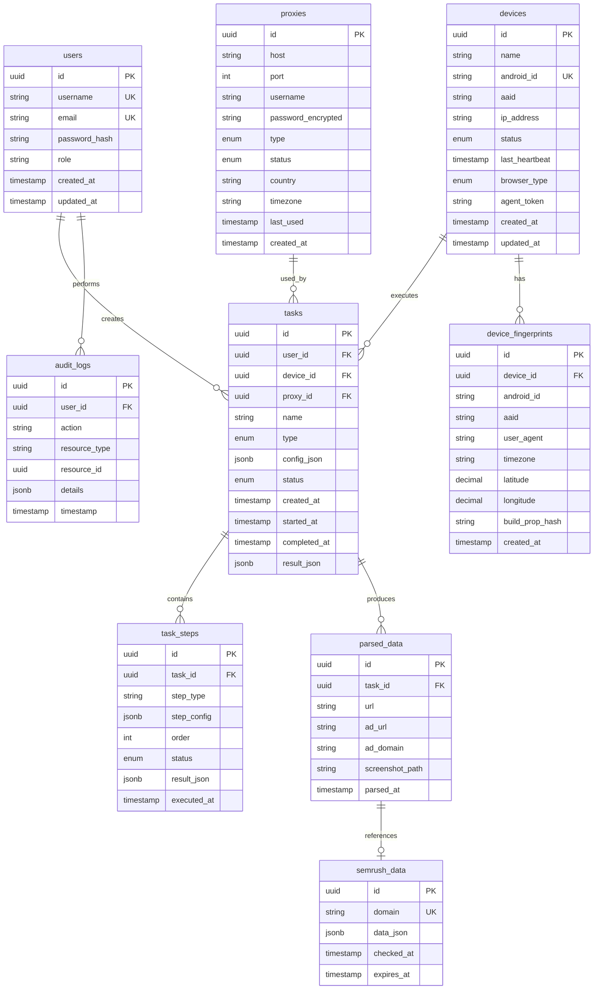

 ERD (Entity Relationship Diagram) - База данных

 Описание схемы базы данных

 Диаграмма связей

 Детальное описание таблиц

 1. users
Таблица пользователей системы (для веб-интерфейса)

| Поле | Тип | Описание |
|------|-----|----------|
| id | UUID (PK) | Уникальный идентификатор |
| username | VARCHAR(50) (UNIQUE) | Имя пользователя |
| email | VARCHAR(255) (UNIQUE) | Email адрес |
| password_hash | VARCHAR(255) | Хеш пароля (bcrypt) |
| role | ENUM('admin', 'operator', 'viewer') | Роль пользователя |
| created_at | TIMESTAMP | Дата создания |
| updated_at | TIMESTAMP | Дата обновления |

**Индексы:**
- PRIMARY KEY (id)
- UNIQUE (username)
- UNIQUE (email)
- INDEX (role)

 2. devices
Таблица зарегистрированных Android устройств

| Поле | Тип | Описание |
|------|-----|----------|
| id | UUID (PK) | Уникальный идентификатор |
| name | VARCHAR(100) | Имя устройства (опционально) |
| android_id | VARCHAR(16) (UNIQUE) | Android ID устройства |
| aaid | VARCHAR(36) | Advertising ID |
| ip_address | INET | IP адрес устройства |
| status | ENUM('online', 'offline', 'busy', 'error') | Текущий статус |
| last_heartbeat | TIMESTAMP | Время последнего heartbeat |
| browser_type | ENUM('chrome', 'webview') | Предпочитаемый браузер |
| agent_token | VARCHAR(255) | Токен для аутентификации агента |
| created_at | TIMESTAMP | Дата регистрации |
| updated_at | TIMESTAMP | Дата обновления |

**Индексы:**
- PRIMARY KEY (id)
- UNIQUE (android_id)
- INDEX (status)
- INDEX (last_heartbeat)

 3. tasks
Таблица задач для выполнения на устройствах

| Поле | Тип | Описание |
|------|-----|----------|
| id | UUID (PK) | Уникальный идентификатор |
| user_id | UUID (FK → users.id) | Создатель задачи |
| device_id | UUID (FK → devices.id, NULL) | Назначенное устройство (NULL = любое) |
| proxy_id | UUID (FK → proxies.id, NULL) | Используемый прокси (NULL = без прокси) |
| name | VARCHAR(255) | Название задачи |
| type | ENUM('surfing', 'parsing', 'uniqueness', 'screenshot') | Тип задачи |
| config_json | JSONB | Конфигурация задачи (шаги, параметры) |
| status | ENUM('pending', 'assigned', 'running', 'completed', 'failed', 'cancelled') | Статус выполнения |
| created_at | TIMESTAMP | Дата создания |
| started_at | TIMESTAMP (NULL) | Время начала выполнения |
| completed_at | TIMESTAMP (NULL) | Время завершения |
| result_json | JSONB (NULL) | Результаты выполнения |

**Индексы:**
- PRIMARY KEY (id)
- INDEX (user_id)
- INDEX (device_id)
- INDEX (status)
- INDEX (created_at)
- INDEX (type)

 4. task_steps
Таблица шагов выполнения задачи

| Поле | Тип | Описание |
|------|-----|----------|
| id | UUID (PK) | Уникальный идентификатор |
| task_id | UUID (FK → tasks.id) | Родительская задача |
| step_type | VARCHAR(50) | Тип шага (navigate, wait, click, extract, screenshot) |
| step_config | JSONB | Конфигурация шага |
| order | INTEGER | Порядок выполнения |
| status | ENUM('pending', 'running', 'completed', 'failed') | Статус шага |
| result_json | JSONB (NULL) | Результат выполнения шага |
| executed_at | TIMESTAMP (NULL) | Время выполнения |

**Индексы:**
- PRIMARY KEY (id)
- INDEX (task_id)
- INDEX (task_id, order)
- INDEX (status)

 5. proxies
Таблица прокси-серверов

| Поле | Тип | Описание |
|------|-----|----------|
| id | UUID (PK) | Уникальный идентификатор |
| host | VARCHAR(255) | Хост прокси |
| port | INTEGER | Порт прокси |
| username | VARCHAR(255) (NULL) | Имя пользователя |
| password_encrypted | VARCHAR(255) (NULL) | Зашифрованный пароль |
| type | ENUM('http', 'https', 'socks5') | Тип прокси |
| status | ENUM('active', 'inactive', 'error') | Статус прокси |
| country | VARCHAR(2) (NULL) | Код страны прокси (ISO 3166-1 alpha-2, например 'US', 'GB') |
| timezone | VARCHAR(50) (NULL) | Таймзона прокси (например 'America/New_York', 'Europe/London') |
| last_used | TIMESTAMP (NULL) | Время последнего использования |
| created_at | TIMESTAMP | Дата добавления |

**Индексы:**
- PRIMARY KEY (id)
- INDEX (status)
- INDEX (type)
- INDEX (country)
- INDEX (last_used)

 6. parsed_data
Таблица спарсенных данных с веб-страниц

| Поле | Тип | Описание |
|------|-----|----------|
| id | UUID (PK) | Уникальный идентификатор |
| task_id | UUID (FK → tasks.id) | Задача, которая создала данные |
| url | TEXT | URL страницы, с которой парсили |
| ad_url | TEXT (NULL) | Извлеченный adurl из рекламной ссылки |
| ad_domain | VARCHAR(255) (NULL) | Домен рекламодателя (извлечен из ad_url) |
| screenshot_path | VARCHAR(500) (NULL) | Путь к скриншоту в MinIO/S3 |
| parsed_at | TIMESTAMP | Время парсинга |

**Индексы:**
- PRIMARY KEY (id)
- INDEX (task_id)
- INDEX (ad_domain)
- INDEX (parsed_at)
- UNIQUE (task_id, ad_domain) -- предотвращение дубликатов

 7. semrush_data
Таблица результатов проверки доменов через Semrush API

| Поле | Тип | Описание |
|------|-----|----------|
| id | UUID (PK) | Уникальный идентификатор |
| domain | VARCHAR(255) (UNIQUE) | Проверяемый домен |
| data_json | JSONB | Полный JSON ответ от Semrush API |
| checked_at | TIMESTAMP | Время проверки |
| expires_at | TIMESTAMP | Время истечения кеша (24 часа) |

**Индексы:**
- PRIMARY KEY (id)
- UNIQUE (domain)
- INDEX (expires_at)

 8. device_fingerprints
Таблица истории уникализации устройств

| Поле | Тип | Описание |
|------|-----|----------|
| id | UUID (PK) | Уникальный идентификатор |
| device_id | UUID (FK → devices.id) | Устройство |
| android_id | VARCHAR(16) | Android ID после уникализации |
| aaid | VARCHAR(36) | AAID после уникализации |
| user_agent | TEXT | User Agent после изменения |
| timezone | VARCHAR(50) | Timezone после изменения |
| latitude | DECIMAL(10, 8) | Широта GPS координаты после изменения |
| longitude | DECIMAL(11, 8) | Долгота GPS координаты после изменения |
| build_prop_hash | VARCHAR(64) | Хеш build.prop для отслеживания изменений |
| created_at | TIMESTAMP | Время уникализации |

**Индексы:**
- PRIMARY KEY (id)
- INDEX (device_id)
- INDEX (device_id, created_at)

 9. audit_logs
Таблица аудит-логов всех действий в системе

| Поле | Тип | Описание |
|------|-----|----------|
| id | UUID (PK) | Уникальный идентификатор |
| user_id | UUID (FK → users.id, NULL) | Пользователь (NULL для действий агентов) |
| action | VARCHAR(100) | Действие (create, update, delete, execute, etc.) |
| resource_type | VARCHAR(50) | Тип ресурса (task, device, proxy, etc.) |
| resource_id | UUID (NULL) | ID ресурса |
| details | JSONB (NULL) | Дополнительные детали действия |
| timestamp | TIMESTAMP | Время действия |

**Индексы:**
- PRIMARY KEY (id)
- INDEX (user_id)
- INDEX (resource_type, resource_id)
- INDEX (timestamp)
- INDEX (action)

 Связи между таблицами

1. **users → tasks** (1:N)
   - Один пользователь может создать множество задач
   - ON DELETE: SET NULL (задачи остаются, но user_id = NULL)

2. **devices → tasks** (1:N)
   - Одно устройство может выполнить множество задач
   - ON DELETE: SET NULL (задачи остаются, но device_id = NULL)

3. **tasks → task_steps** (1:N)
   - Одна задача содержит множество шагов
   - ON DELETE: CASCADE (шаги удаляются с задачей)

4. **tasks → parsed_data** (1:N)
   - Одна задача может создать множество записей парсинга
   - ON DELETE: CASCADE

5. **proxies → tasks** (1:N)
   - Один прокси может использоваться в множестве задач
   - ON DELETE: SET NULL

6. **parsed_data → semrush_data** (N:1)
   - Множество записей парсинга могут ссылаться на один домен в Semrush
   - Связь через поле ad_domain (не FK, т.к. может быть NULL)

7. **devices → device_fingerprints** (1:N)
   - Одно устройство имеет историю уникализаций
   - ON DELETE: CASCADE

8. **users → audit_logs** (1:N)
   - Один пользователь может иметь множество записей в логах
   - ON DELETE: SET NULL
 Ограничения и правила

 Уникальность
- `devices.android_id` - уникален (одно устройство = один android_id)
- `parsed_data(task_id, ad_domain)` - уникальная комбинация (предотвращение дубликатов)
- `semrush_data.domain` - уникален (один домен = одна запись)

 Проверки (CHECK constraints)
- `devices.status` IN ('online', 'offline', 'busy', 'error')
- `tasks.status` IN ('pending', 'assigned', 'running', 'completed', 'failed', 'cancelled')
- `proxies.port` BETWEEN 1 AND 65535
- `proxies.type` IN ('http', 'https', 'socks5')

 Триггеры
- Автоматическое обновление `updated_at` при изменении записи
- Автоматическое создание записи в `audit_logs` при изменении критичных данных
- Автоматическая очистка истекших записей в `semrush_data` (expires_at < NOW())

 Миграции

Все изменения схемы БД должны выполняться через миграции Prisma:
- Версионирование миграций
- Откат изменений при необходимости
- Тестирование миграций на тестовой БД

